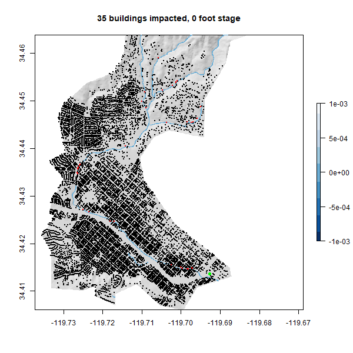

```{r setup, include=FALSE}
knitr::opts_chunk$set(warning = FALSE, message = FALSE, out.width = "75%", fig.align = 'center')
```

```{r}
library(tidyverse)
library(knitr)
library(readxl)
library(zoo)
library(mapview)
library(units)
library(sf)        # vector manipulation
library(raster)    # raster manipulation
library(fasterize) # "faster" raster
library(whitebox)  # terrain analysis

# Data libraries
library(osmdata)   # OSM API
library(elevatr)   # Elevation  Web Tiles
```

### Collecting Data

#### Basin Boundary
```{r, warning = F, message = F}
basin = read_sf('https://labs.waterdata.usgs.gov/api/nldi/linked-data/nwissite/USGS-11119750/basin')
```

#### Elevation Data
```{r, warning = F, message = F}
elev  = elevatr::get_elev_raster(basin, z = 13) %>%
  crop(basin) %>% 
  mask(basin)
elev2 = elev*3.281
plot(elev2)
writeRaster(elev, "../data/basin-elev.tif", overwrite = TRUE)
```

#### Buildings and river-network data
```{r, warning = F, message = F}
osm_buildings = osmdata::opq(basin) %>% 
  osmdata::add_osm_feature("building") %>% 
  osmdata::osmdata_sf()

buildings = osm_buildings$osm_polygons %>% 
  st_transform(crs(elev2))

building_c = st_centroid(buildings) %>% 
  st_intersection(basin)

railway = dplyr::filter(building_c, amenity == "railway")

osm_streams = osmdata::opq(basin) %>% 
  add_osm_feature(key = 'waterway', value = "stream") %>% 
  osmdata_sf()

streams = osm_streams$osm_lines %>% 
  st_intersection(basin)
```

### Terrain Analysis

#### Hillshade
```{r, warning = F, message = F}
wbt_hillshade("../data/basin-elev.tif", "../data/basin-hillshade.tif")
hillshade = raster("../data/basin-hillshade.tif")
plot(hillshade, col = gray.colors(256, alpha = .5), legend = FALSE)
plot(streams, add = TRUE, col = "blue")
plot(basin, add = TRUE)
```

#### Height Above Nearest Drainage

##### Creating the river raster
```{r, warning = F, message = F}
streams2 = streams %>% 
  st_transform(5070) %>% 
  st_buffer(10) %>% 
  st_transform(crs(streams)) %>% 
  fasterize::fasterize(elev2)

writeRaster(streams2, "../data/stream_polygon.tif", overwrite = TRUE)
```

##### Creating the hydrologically corrected surface
```{r, warning = F, message = F}
wbt_breach_depressions("../data/basin-elev.tif", "../data/conditioned.tif")
```

##### Creating the HAND raster
```{r, warning = F, message = F}
wbt_elevation_above_stream("../data/conditioned.tif", "../data/stream_polygon.tif", "../data/HAND.tif")
```

##### Correcting to local reference datum
```{r, warning = F, message = F}
HAND = raster("../data/HAND.tif") + 3.69
riverr = raster("../data/stream_polygon.tif")

HAND[riverr == 1] = 0

writeRaster(HAND, "../data/correct_HAND.tif", overwrite = TRUE)
```

### 2017 Impact Assessment

#### Map the flood
```{r, warning = F, message = F}
cHAND = raster("../data/correct_HAND.tif")

cHAND[cHAND > 10.02] = NA

plot(hillshade, col = gray.colors(256, alpha = .5), legend = FALSE)
plot(cHAND, add = TRUE, col = rev(blues9))
plot(railway, add = TRUE, col = "green", cex = 1, pch = 16)
```
Yes this map looks accurate, the lower areas are flooded all the up to 10 feet higher than the normal water level.

#### Estimate the impacts
```{r, warning = F, message = F}
flooddepth = raster::extract(cHAND, building_c, na.rm = TRUE)

noimpact = sum(!is.na(flooddepth))

impacted = mutate(building_c, 
                     impact = raster::extract(cHAND, building_c)) %>% 
  filter(impact != "NA") %>% 
  dplyr::select(geometry)


plot(hillshade, col = gray.colors(256, alpha = .5), legend = FALSE, main = paste(sum(!is.na(flooddepth)), "buildings impacted,", round(max(values(cHAND), na.rm = TRUE), digits = 2), "foot stage"))
plot(cHAND, add = TRUE, col = rev(blues9))
plot(building_c, add = TRUE, col = "black", pch = 16, cex = .08)
plot(impacted, add = TRUE, col = "red", pch = 16, cex = .08)
plot(railway, add = TRUE, col = "green", cex = 1, pch = 16)


```


### Extra Credit: FIM Library

#### New AOI
```{r, warning = F, message = F}
(sb = AOI::aoi_get("Santa Barbara"))

building_c2 = building_c %>% 
  st_intersection(sb)

basin2 = basin %>%
  st_intersection(sb)

cHAND2 = raster("../data/correct_HAND.tif") %>% 
  crop(sb) %>% 
  mask(sb)

hillshade2 = hillshade %>% 
  crop(sb) %>% 
  mask(sb)
```

#### Make GIF
```{r, warning = F, message = F, eval = F}
gifski::save_gif({
  for(i in 0:20) {
    
cHAND3 = cHAND2

cHAND3[cHAND3 > i] = NA  
    
flooddepth2 = raster::extract(cHAND3, building_c2, na.rm = TRUE)

noimpact2 = sum(!is.na(flooddepth2))

impacted2 = mutate(building_c2, 
                     impact = raster::extract(cHAND3, building_c2)) %>% 
  filter(impact != "NA") %>% 
  dplyr::select(geometry)

plot(hillshade2, col = gray.colors(256, alpha = .5), legend = FALSE, main = paste(sum(!is.na(flooddepth2)), "buildings impacted,", i, "foot stage"))
plot(cHAND3, add = TRUE, col = rev(blues9))
plot(building_c2, add = TRUE, col = "black", pch = 16, cex = .08)
plot(impacted2, add = TRUE, col = "red", pch = 16, cex = .08)
plot(railway, add = TRUE, col = "green", cex = 1, pch = 16)
    
  }
}, gif_file = "../data/mission-creek-fim.gif",
   width = 600, height = 600, 
   delay = .7, loop = TRUE)
```

#### The FIM Library GIF


We are capturing impacted buildings because we added a 10m buffer to the stream, causing it to cover more area than it actually does.


